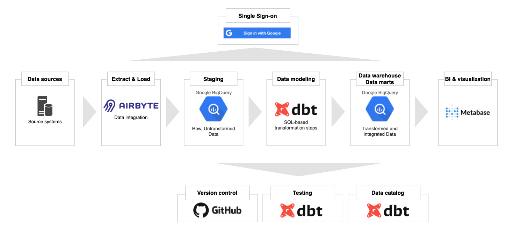
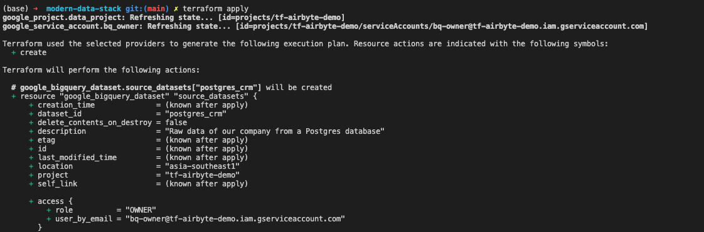
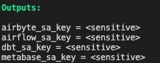
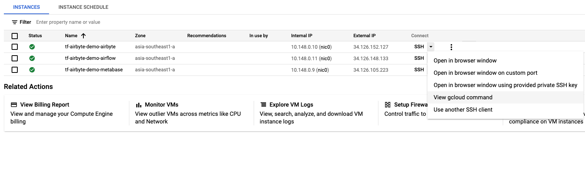

# Modern Data Stack

Get started with the modern data stack in five minutes using Terraform. Read more about this repo in my blog post [here](https://towardsdatascience.com/bootstrap-a-modern-data-stack-in-5-minutes-with-terraform-32342ee10e79).

This repo is intended for everyone to get started with the modern data stack effortlessly. It is not recommended to run this code in a production environment. 
## Architecture



- Ingestion: **Airbyte**
- Warehousing: **BigQuery**
- Transformation: **dbt**
- Orchestration (optional): **Airflow**
- BI & data discovery: **Metabase**

Terraform will create a project on Google Cloud Platform, provision virtual machines for different services, and spin up other necessary resources. 

## Get Started

### Create a Google Cloud account and enable billing

The Terraform code in this project will interact with the Google Cloud Platform. Therefore, our first step to creating a Google account and [enable billing](https://cloud.google.com/billing/docs/how-to/modify-project). Note the `billing ID` with the following format in the Billing Page: `######-######-######`. You will need this value in the next step. 

### Install Google Cloud CLI 

Install Google Cloud SDK following the instructions [here](https://cloud.google.com/sdk/docs/quickstart) for your respective OS. After you have the `gcloud` CLI installed, run the following command in a terminal window and follow the instructions. This will let Terraform use the default credential for authentication.

```bash
gcloud auth application-default login
```

### Install terraform

Follow the instructions [here](https://learn.hashicorp.com/tutorials/terraform/install-cli) to install the Terraform CLI locally. Run the following command afterward to check your installation: 

```bash 
terraform -v
```

You should see something like this:

```
Terraform v1.0.0
on darwin_amd64
+ provider registry.terraform.io/hashicorp/google v3.71.0
```

### Fork or clone this repo locally 

You can fork this repo to your account or clone it to your local machine. To clone the repo, run the following: 

```bash
git clone https://github.com/tuanchris/modern-data-stack
cd modern-data-stack
```

### Create a `terraform.tfvars` file

Create a `terraform.tfvars` file with the following content:

```
# The Billing ID from the first step
billing_id = ######-######-######
# The folder ID of where you want your project to be under
# Leave this blank if you use a personal account
folder_id  = ""
# The organization ID of where you want your project to be under
# Leave this blank if you use a personal account
org_id     = ""
```

**Warning**: These are considered sensitive values. Do not commit this file and the `*.tfstate` files to a public repo. 

### Customize the values in `variables.tf`

The variables in `variables.tf` will be used for the configurations of the resources. At the very least, change the value for `project_id` to a globally unique value of your choosing. 

You can customize the machine type for different services by changing the variables. If you don't want to use any service, comment it out in the `gce.tf` file. 

You can also create different datasets for your source systems by adding them to the sources datasets dictionary. 

### Create a modern data stack

Finally, to provision all these resources on Google Cloud, run the following command:

```terraform
terraform apply
```



Study the output in the terminal to make sure that all resource settings are what you want them to be. Type `yes` and hit `enter`.

Terraform will create a Google Cloud project with our modern data stack. The whole process will take about 2-3 minutes. It takes an additional 2–3 minutes for the services to be installed on VM instances. The whole process will only take 5 minutes or less.

## Using the modern data stack

### Retrieve service accounts for different services



Google recommends using a different service account for different services. The terraform code in the project has created different accounts for different technologies used already. To retrieve a service account for a particular service, run the following command: 

```bash
terraform output [service_name]_sa_key
```

The default permission for all these accounts is `roles/bigquery.admin`. You can customize this in the `iam.tf` file.

The value you got back is base64 encoded. To turn this value back to the `JSON format`, run the following command: 

```bash
echo "[value from the previous command]" | base64 -d
```

You can use the JSON service account to authenticate the service access to your project's resources. 

**Warning**: Anyone with this service account can access your project. 

### Ingest data with Airbyte 

[Airbyte](https://airbyte.io/) is an excellent open-source data integration tool. To access the Airbyte UI, first, get the gcloud SSH command. 



You will get a command similar to this: `gcloud beta compute ssh --zone "asia-southeast1-a" "tf-airbyte-demo-airbyte"  --project "tf-airbyte-demo"`. Next, add the following to the command to port-forward the Airbyte UI locally: ` -- -L 8000:localhost:8000 -L 8001:localhost:8001 -N -f`. Your final command will look like this: 

```
gcloud beta compute ssh --zone "asia-southeast1-a" "tf-airbyte-demo-airbyte"  --project "tf-airbyte-demo" -- -L 8000:localhost:8000 -L 8001:localhost:8001 -N -f
```

**Note:** Be sure to delete the newline character after copying from the GCP UI. 

If the Airbyte instance has finished starting up, you can access it by going to your browser and visit `localhost:8000`. If not, wait five minutes for the instance to complete the installation. 

Now you can integrate your sources, add a BigQuery destination using the `airbyte_sa_key`, and have your data in BigQuery in no time. 

You can access the Airbyte installation at `/airbyte/` inside the VM.
### Model data with dbt

[dbt](https://www.getdbt.com) (data build tool) is a powerful open-source data transformation tool using SQL. It enables Data Analysts to do the work previously reserved for Data Engineers. It also helps create an entirely new position called Analytics Engineer, a hybrid of a Data Analyst and a Data Engineer. You can read more about the position in my blog [here](https://tuanchris.medium.com/become-an-analytics-engineer-in-90-days-759659d22ffd). 

Unlike Airbyte, Airflow, and Metabase, you don't need a server to run dbt. You can register for a free (forever) 1-seat account by visiting their [website](https://www.getdbt.com/signup/).
### Orchestrate workflow with Airflow

[Airflow](https://airflow.apache.org/) is a battle-proven workflow orchestration tool created by Airbnb. With a modern data stack, hopefully, you won't have to use Airflow a lot. However, in some cases where some customization is needed, Airflow can be your go-to tool. 

To access the UI, get the SSH command similar to the above section with Airbyte. Use the following command for port-forward: 

```bash
gcloud beta compute ssh --zone "asia-southeast1-a" "tf-airbyte-demo-airflow"  --project "tf-airbyte-demo" -- -L 8080:localhost:8080 -N -f
```

Now you can access the Airflow installation at `localhost:8080`. The default username & password are `admin` and `admin`.

You can access the airflow installation at `/airflow/` inside the VM.
### Visualize data with Metabase

[Metabase](https://www.metabase.com/) is an open-source data visualization and discovery tool. It is super user-friendly and easy to get started with. 

To access the Metabase UI, get the SSH command similar to the above section with Airbyte. Then, use the following command for port-forward: 

```
gcloud beta compute ssh --zone "asia-southeast1-a" "tf-airbyte-demo-metabase"  --project "tf-airbyte-demo" -- -L 3000:localhost:3000 -N -f
```
## Clean up

To avoid any unwanted cost incurred, be sure to clean up the resources created in this project by running.

```
terraform destroy
```

**Warning:** This will delete any persisted data and resources in the project. Alternatively, you can turn off the unused GCE to save costs as well.
